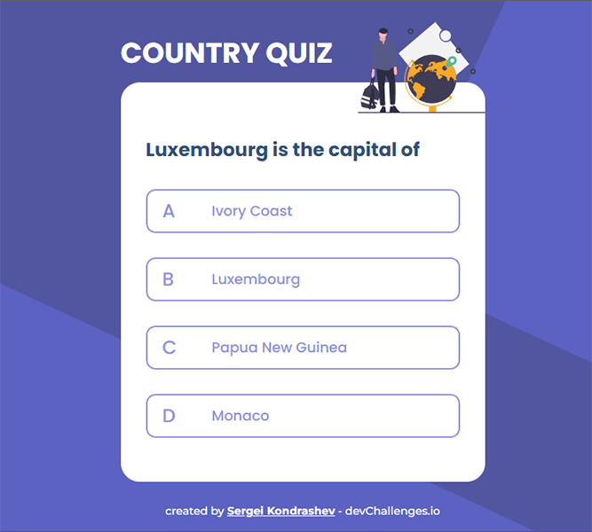
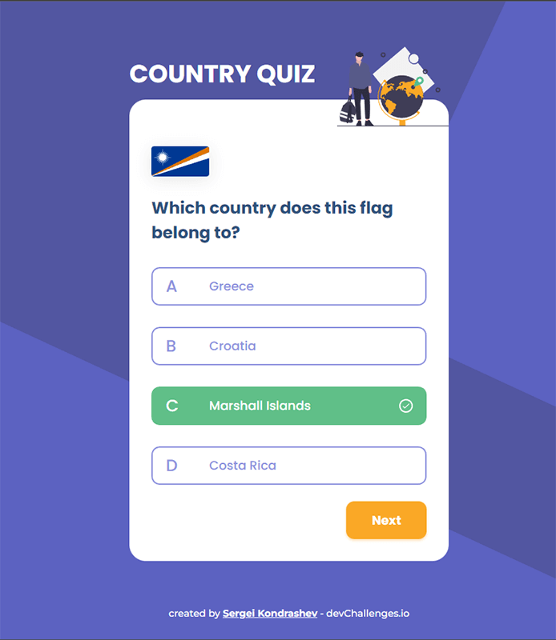

# Country-quiz

Solution for the [Country Challenge](https://devchallenges.io/challenges/Bu3G2irnaXmfwQ8sZkw8) from [Devchallenges.io](https://devchallenges.io).

## Challenge

Challenge: Create a country quiz app using an API.
Fulfill user stories below:

- User story: I can see at least 2 types of questions: a city is the capital of.. or a flag belong to country..
- User story: I can select an answer
- User story: I can see if my answer is correct or incorrect
- User story: When I answer correctly, I can move on to the next question
- User story: When I answer incorrectly, I can see my results and try again
- User story: I can try again

### Demo

Find the site in action [here](https://countries-pinia.surge.sh/)!

#### Quiz Question - type 1



#### Quiz Question - type 2



#### Results Page


### Built With

- [Vue 3](https://vuejs.org/)
- [Pinia](https://pinia.vuejs.org/)

## Project Setup

```sh
npm install
```

### Compile and Hot-Reload for Development

```sh
npm run dev
```

### Compile and Minify for Production

```sh
npm run build
```

### Lint with [ESLint](https://eslint.org/)

```sh
npm run lint
```
